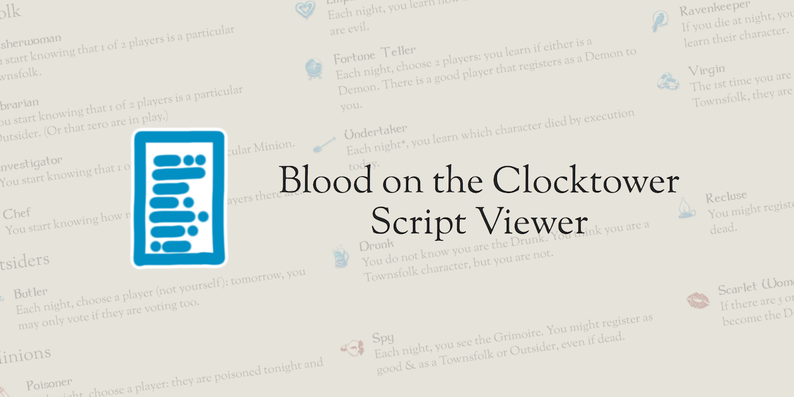

# [BotC Script Viewer](https://botc-script-viewer.sthom.kiwi)

A web app for viewing scripts for [Blood on the Clocktower](https://bloodontheclocktower.com/). I made this because I was going somewhere I knew people would have phones but not printers.



## How does it work?

Simple.

On the home page, paste a script JSON or URL pointing to a script JSON. This site will send you to a URL containing all of the script's data. You can do whatever you like with this, share it, print it, forget about it, or whatever else you do with a website.

If you do choose to print the page, it'll be all nicely formatted and ready to go. The final page will also have a QR code for people to scan to view the script digitally.


If you want the technical details of how the site works, well, you're in the right place. The most interesting part will be [how scripts are represented in the URLs](./docs/number-store-v1.md), but there's more in the code.


## Acknowledgements

This site is not in any way affiliated with The Pandemonium Institute. All roles and characters are the property of Steven Medway and The Pandemonium Institute.

Blood on the Clocktower is a trademark of Steven Medway and The Pandemonium Institute.

## Development instructions

<details>
<summary>Development instructions</summary>

Requires a modern version of Node.

```sh
npm ci
npm run setup
npm run dev
```

</details>
