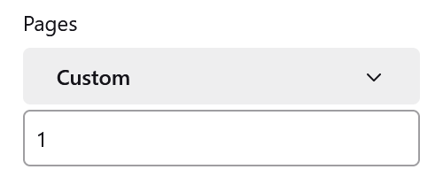
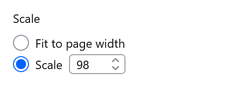

This website was built with printing in mind. For the most part, this
means you can use the print functionality in your browser (`ctrl/cmd + P`) and not have to worry about formatting anything.

Given you're probably trying to print a script to actually play with,
you'll want to be smart about how you print. It's all pretty common sense
stuff, but if you've never used these options in the print menu before
then you might not think to use them.

## Multiple print jobs

If you print with no changes to the print settings, then you're going to
get a copy of every page for every copy. If you're in a 15 player game,
you don't need 15 copies of the night order. What you should probably do
instead is go through the print menu multiple times.

1. Print only page 1, but make 15 copies...
2. ...then print every page except page 1, making only 1 copy.

## Scaling

Scripts can be all shapes and sizes, and sometimes have slightly too much
to fit on a single page. While the layout will try to prevent other parts
of the script, like the night order, from appearing directly below, you
might want to save the paper by fitting all of the characters on the first
page.

This problem cam happen more often on scripts with custom characters, as
their abilities might be longer than the official ones.

If characters are jumping onto the next page, just change the scaling in
the print menu. Usually you won't need to go under 90% in order to fit the
entire script on.

## Night Order

Sometimes the heading for the night order ends up on its own page, with
the actual list below it. I'll be honest, I don't know how to fix this one
properly. I've tried.

If this happens, you can try one of two things:

1. Use the same scaling as above until the night order fits on one page.
2. Skip printing the page with just the heading on.

Hopefully these tips help to make printing your scripts just a little bit
easier.
